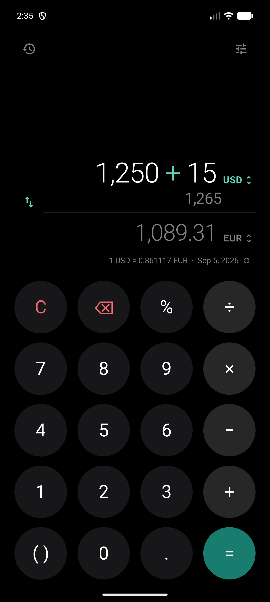
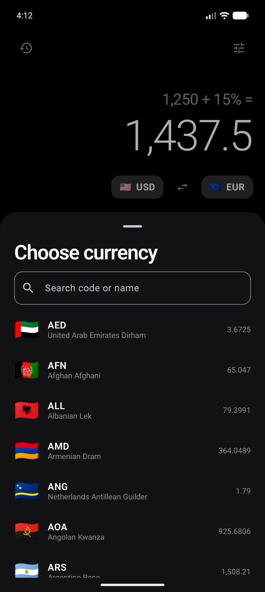
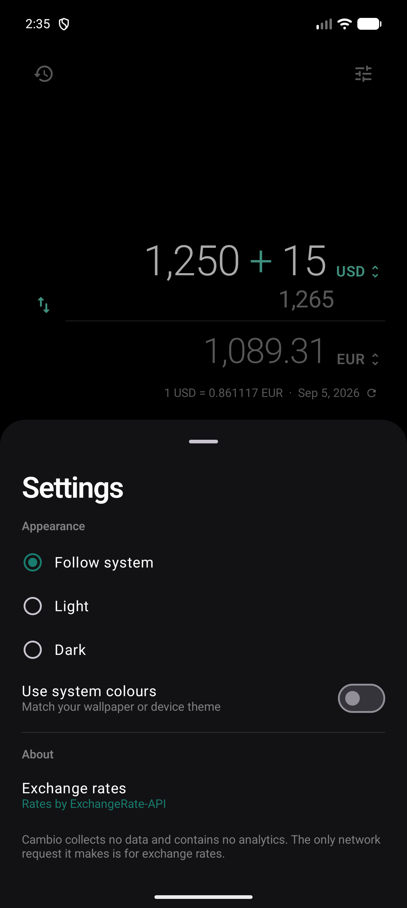
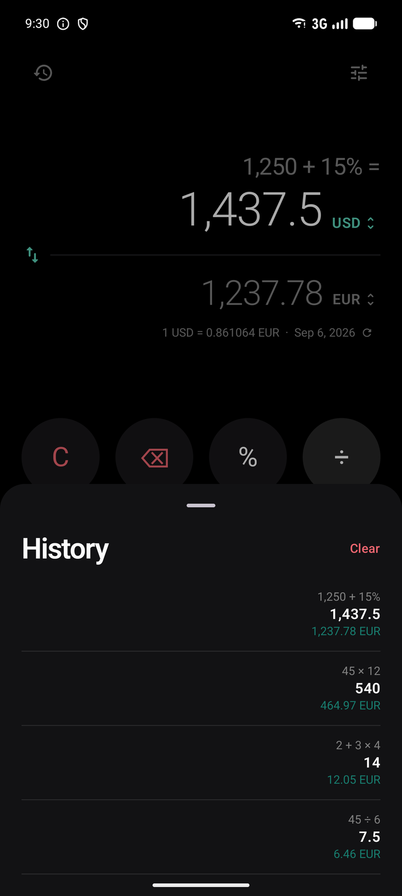
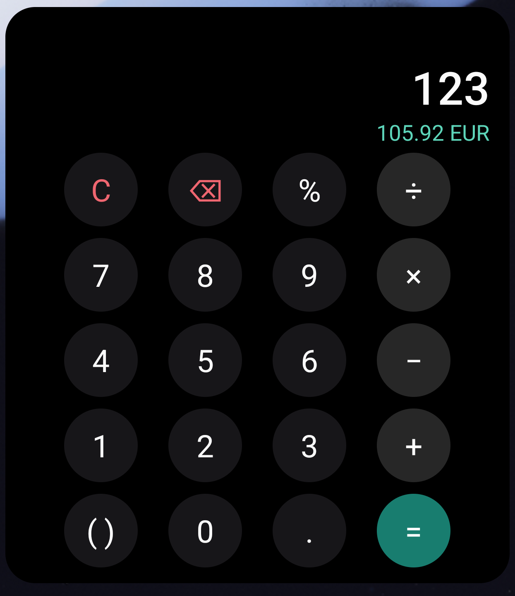

<div align="center">

# Cambio

**A calculator that speaks every currency.**

A native Android calculator with live currency conversion built in — as a full app
and as a home-screen widget, sharing one design and one calculator engine.

[](LICENSE)
[](#requirements)
[](https://kotlinlang.org)
[](https://developer.android.com/jetpack/compose)

</div>

---

## What it is

Most currency apps are a form: type an amount, pick two currencies from dropdowns,
press *Convert*. Cambio is a **calculator first**. You do the maths you were going
to do anyway — split a bill, add 15%, work out a total — and the converted value is
simply there underneath, updating as you type.

The same calculator runs on your home screen as a widget, with the same keypad, the
same engine and the same theme.

## Screenshots

| Calculator | Currency picker | Settings |
| :---: | :---: | :---: |
|  |  |  |

| History | Home-screen widget |
| :---: | :---: |
|  |  |

*Captured on a Pixel 10 Pro XL emulator.*

## How it was built

The keypad follows Samsung's One UI Calculator, and not by eye. Key diameters,
gutters, the exact greys, the press halo and every animation timing were **measured
from screen recordings frame by frame** — the entry animation, for instance, is a
new character growing from 30% to full over 180ms on One UI's easing curve, because
that is what stepping through the frames showed.

Where One UI has no equivalent to copy, the iOS Calculator's converter is the model
instead: paired figures with the currency code as the control, an active side you
type into, and a list that gives the name room and rules between the rows.

## Features

**Calculator**

- Full operator precedence — `2 + 3 × 4` is `14`, not `20`
- Parentheses, via one context-aware `( )` key that inserts whichever bracket fits
- Contextual percent, the way a physical calculator behaves:
  `200 + 10%` → `220`, `200 × 10%` → `20`, a bare `50%` → `0.5`
- **Exact decimal arithmetic.** `0.1 + 0.2` is `0.3`, not `0.30000000000000004` —
  everything runs on `BigDecimal`, never binary floating point
- Chained calculations, backspace and clear
- **The expression leads while you type**, operators tinted, and equals leaves just
  the answer — no expression lingering above a number that has moved on
- **Equals repeats.** `2 × 2 =` gives 4; press it again for 8, again for 16. The last
  operation is held over and reapplied to each result, as a pocket calculator does.
  Pressing it on a plain number does nothing, because there is nothing to repeat
- **Edit anywhere in the number.** A caret marks your place, with the platform's own
  drag handle beneath it to slide through a long figure. The soft keyboard never
  appears — the keypad is the only way in
- **Each character grows in where the caret is**, so typing into the middle of a
  figure leaves every digit after it perfectly still
- **The type size is measured, not guessed.** It steps down to keep a long number
  whole, fitted against the box the screen actually gives it, so it holds on any
  width. Past fifteen digits a brief message says so, rather than the keypad going
  quietly dead
- An incomplete expression floats a brief message and **leaves your input alone**,
  rather than blanking the display
- Numbers beyond `Long` range, with scientific notation past `1e16`

**Currency**

- 160+ currencies, live rates
- **Convert in either direction.** Tap either figure to type in that currency; the
  other follows. Neither figure moves — the active one is simply the bright one and
  the idle one greys out. Values carry across when you switch, so nothing is lost
- Swap direction with one tap
- Searchable picker by code *or* name, with recents pinned. Rows give the full name
  the whole width — enough for the longest of them, `Bosnia-Herzegovina Convertible
  Mark` — rather than clipping it mid-word
- **An index scrubber** down the edge whose letter drop is pulled out of the rail and
  falls back into it, because a stack of 26 tappable letters is cramped and imprecise
  at this length
- Amounts rounded to each currency's real minor units — 2 for USD, **0 for JPY**,
  **3 for KWD** — escalating precision so a tiny amount never renders as a
  misleading `0.00`
- Rate line showing the live rate and when it was last updated; tap to refresh

**App**

- Home-screen widget running the identical calculator and keypad, with both
  currencies side by side, a tappable active side and a swap control between them.
  Every dimension is derived from the widget's own size, so it stays legible as you
  resize it, and it follows the app: change a currency there and the widget redraws
  without being touched
- Light and dark themes, following the system by default, with an optional
  Material You / system-colour mode that picks up your device or OEM theme
- Calculation history (last 100), tap to restore. Only actual calculations are
  filed, and only on equals: a number you typed and never operated on is not a
  calculation and does not appear
- Landscape and tablet layouts, not a locked-portrait phone app
- Full TalkBack support and WCAG 2.1 AA contrast
- Numbers formatted for your device locale — `1,234.5` or `1.234,5`, with the
  keypad's decimal key matching

## Requirements

| | |
| --- | --- |
| **Minimum Android** | 8.0 Oreo (API 26) |
| **Compiled / target** | API 36 |
| **JDK** | 21 (Android Studio's bundled JBR works) |
| **Android SDK** | Platform 36, Build-Tools 36 |
| **Gradle** | 8.13 (via the included wrapper) |
| **Kotlin / AGP** | 2.2.21 / 8.13.2 |

## Getting started

```bash
git clone https://github.com/Angad7600123/cambio.git
cd cambio
```

Point Gradle at your SDK by creating `local.properties` in the project root:

```properties
sdk.dir=/path/to/Android/Sdk
```

That file is machine-specific and is deliberately git-ignored.

### Run

```bash
./gradlew installDebug
```

Or open the project in Android Studio and press Run.

### Build

```bash
./gradlew assembleDebug
```

```bash
./gradlew assembleRelease
```

Release builds are minified with R8 and are **unsigned** — no keystore is committed
to this repository. Add your own signing configuration to produce a distributable
artifact.

### Add the widget

Long-press the home screen → **Widgets** → **Cambio**. It lands at 4×5 cells and
resizes freely in both directions from there, down to roughly 180×200dp.

## Exchange rates

Rates come from **[ExchangeRate-API](https://www.exchangerate-api.com)**, via its
free open endpoint:

```
GET https://open.er-api.com/v6/latest/USD
```

**No API key is required, and there are no secrets in this repository.** There is
nothing to configure and no environment variable to set — clone and run.

### How caching works

The app fetches **one rate table, quoted against USD**, and derives every other
pair locally:

```
rate(FROM → TO) = rates[TO] / rates[FROM]
```

One network request therefore serves all 160+ × 160+ currency pairs, and switching
currencies never touches the network.

- **Expiry is whatever the provider says it is.** The response carries a
  `time_next_update_unix` field, and that is used as the cache expiry — the app does
  not invent a TTL of its own. (If the provider ever omits it, a 24-hour fallback
  applies.)
- A refresh is attempted on launch, on returning to the foreground, and when you tap
  the rate line — but only if the cached table has actually expired.
- **Stale-while-error.** If a refresh fails, the previous rates are kept and shown,
  marked *"Rates may be out of date"*. A failed update never blanks out good data.

### Offline behaviour

The **calculator works fully offline** — it is local arithmetic and needs nothing.

- With cached rates, conversion keeps working, flagged as possibly out of date.
- With no cached rates ever (first run, no connectivity), the conversion line shows
  a dash and an inline **Retry**. The keypad remains completely usable.

There are no blocking dialogs and no full-screen spinners anywhere in the app.

### Provider limitations

Worth knowing before you rely on this:

- Rates update roughly **once every 24 hours**. This is not a real-time or
  intraday-trading feed.
- The free open endpoint has **no formal uptime guarantee**.
- Rates are mid-market reference values. They do **not** include the spread, fees or
  margin any bank or exchange will actually charge you.
- The feed quotes onshore and offshore renminbi separately (`CNY` and `CNH`). They
  are the same currency in two markets separated by capital controls, and their
  rates differ by a few tenths of a percent.
- **Attribution is required.** See below.

### Attribution requirement

ExchangeRate-API's terms require applications using the free open endpoint to show
visible attribution linking back to their site. Cambio does this with a tappable
**"Rates by ExchangeRate-API"** link in the Settings sheet.

**If you fork this project, keep that link.** Removing it puts your build out of
compliance with the provider's terms. See [THIRD_PARTY_NOTICES.md](THIRD_PARTY_NOTICES.md).

## Architecture

A single `:app` module with strict package boundaries. The calculator engine is
**pure Kotlin with no Android imports at all**, which is what makes it testable in
isolation and reusable by both the app and the widget.

```
io.github.angad7600123.cambio
├── calculator/   Lexer → ShuntingYard → RpnEvaluator, and the keypress state
│                 machine. Pure Kotlin, BigDecimal, no Android dependency.
├── currency/     Cross-rate arithmetic and ISO 4217 metadata.
├── format/       Locale-aware number, money and expression formatting.
├── data/         Remote data source (OkHttp), DataStore cache, repositories.
├── ui/           Compose screen, components, sheets, theme, ViewModel.
├── widget/       Glance home-screen widget.
└── di/           One AppContainer holding manual constructor injection.
```

**How an expression is evaluated.** The engine never manipulates strings to do
maths. Input is tokenised by a lexer, converted to Reverse Polish Notation with
Dijkstra's shunting-yard algorithm, then evaluated over a stack. That is what gives
real operator precedence for free, and it is why `CalculatorEngine.evaluate()`
**cannot throw** — every failure comes back as a typed `CalcError`.

**Deliberate choices, and why:**

- **No Hilt.** One `AppContainer` with constructor injection gives the same
  testability without an annotation processor or the build time it costs.
- **No Retrofit.** There is exactly one endpoint; plain OkHttp is simpler and just
  as testable.
- **No Room.** A single rate snapshot is not a database — DataStore is the right size.
- **The provider lives behind one file.** `RatesRemoteDataSource` is the only class
  that knows the API exists. Swapping providers means replacing that one file.
- **Currency metadata comes from the platform.** Names, symbols and minor-unit
  counts are read from `java.util.Currency`, so they stay correct as the system
  updates and are already localised. A small supplementary table fills the two gaps
  that leaves — codes outside ISO 4217 that the platform cannot name at all, and
  names that come back word-for-word identical to another currency's. It is a
  fallback, never an override: a device that names a currency itself keeps its own
  answer, in its own language.

## Testing

```bash
./gradlew testDebugUnitTest          # JVM unit tests
./gradlew connectedDebugAndroidTest  # UI tests (needs a device or emulator)
./gradlew spotlessCheck              # formatting
./gradlew lintDebug                  # Android Lint
```

271 unit tests and 27 instrumented tests. **No test ever contacts the real
exchange-rate API** — HTTP is served by a local `MockWebServer`, and the clock is
injected so cache-expiry behaviour is asserted exactly rather than by sleeping.

Coverage focuses on logic that can genuinely break:

- Operator precedence, associativity, parentheses, unary minus
- Which operation equals holds over to repeat, including that a sign is not a
  subtraction and that an operator inside brackets is not the trailing one
- Contextual percent in all four operator positions
- Exact decimal arithmetic, non-terminating division, huge and tiny magnitudes
- Every failure mode: division by zero, malformed input, overflow, empty
- The keypress state machine, including a stress test that mashes the keypad and
  asserts the engine always reaches a verdict
- Caret editing — inserting, deleting and correcting mid-number — and the mapping
  between the raw expression and its grouped, glyphed display form
- Cross-rate maths, missing currencies, and a corrupt zero-rate table
- HTTP 500/404, malformed JSON, empty bodies, missing fields, unreachable server
- Stale-while-error caching, and expiry driven by the provider's own timestamp
- Currency minor units, name fallbacks and locale-aware formatting
- That the key glow never queues: a burst of presses is acted on as it arrives, and
  the last one fades out in exactly its own duration
- Type sizing measured against a real font on a real device, including the exact
  figures that used to clip

There is no enforced coverage threshold — the goal is tests that mean something,
not a number.

## Privacy

Cambio contains **no analytics, no telemetry, no crash reporting, no advertising and
no tracking SDKs.**

- `INTERNET` is the **only** permission requested.
- The **only** outbound request is `GET /v6/latest/USD`. It carries no user data —
  not your amounts, not your calculations, not even which currencies you selected.
- Calculations, history and settings are stored **only on your device** and are never
  transmitted.

## Known limitations

- Rates refresh roughly daily and are mid-market — unsuitable for trading, and not
  what your bank will charge.
- No historical rates or charts; the app shows current rates only.
- No cryptocurrencies.
- English only, though every string is externalised in `strings.xml`, so
  translations are drop-in.
- Release builds are unsigned by design; supply your own keystore.
- Widget interaction goes through `RemoteViews`, so keypresses have a small
  system-imposed latency compared with the app, and the widget has no ripple or
  press animation.

## Contributing

Contributions are welcome — see [CONTRIBUTING.md](CONTRIBUTING.md) and the
[Code of Conduct](CODE_OF_CONDUCT.md).

## License

[MIT](LICENSE) © 2026 Angad Singh Bains

Exchange-rate data is provided by
[ExchangeRate-API](https://www.exchangerate-api.com) and is not covered by this
project's licence. See [THIRD_PARTY_NOTICES.md](THIRD_PARTY_NOTICES.md).
