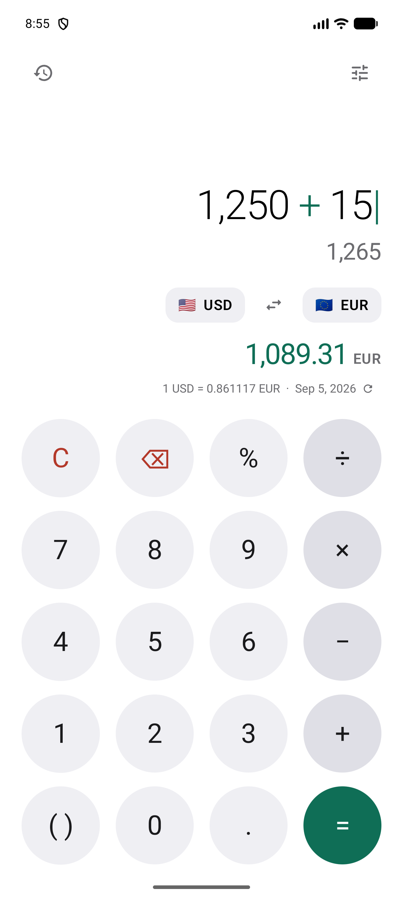

<div align="center">

# Cambio

**A calculator that speaks every currency.**

A native Android calculator with live currency conversion built in — as a full app
and as a home-screen widget, sharing one design and one calculator engine.

[](LICENSE)
[](#requirements)
[](https://kotlinlang.org)
[](https://developer.android.com/jetpack/compose)

</div>

---

## What it is

Most currency apps are a form: type an amount, pick two currencies from dropdowns,
press *Convert*. Cambio is a **calculator first**. You do the maths you were going
to do anyway — split a bill, add 15%, work out a total — and the converted value is
simply there underneath, updating as you type.

The same calculator runs on your home screen as a widget, with the same keypad, the
same engine and the same theme.

## Screenshots

| Calculator (dark) | Currency picker | Settings |
| :---: | :---: | :---: |
|  |  |  |

| Calculator (light) | Home-screen widget |
| :---: | :---: |
|  |  |

*Screenshots captured from the app running on a Pixel 10 Pro XL emulator.*

## Features

**Calculator**

- Full operator precedence — `2 + 3 × 4` is `14`, not `20`
- Parentheses, via one context-aware `( )` key that inserts whichever bracket fits
- Contextual percent, the way a physical calculator behaves:
  `200 + 10%` → `220`, `200 × 10%` → `20`, a bare `50%` → `0.5`
- **Exact decimal arithmetic.** `0.1 + 0.2` is `0.3`, not `0.30000000000000004` —
  everything runs on `BigDecimal`, never binary floating point
- Chained calculations, backspace, clear, and typed errors
  ("Cannot divide by zero", not a generic *Error*)
- Numbers beyond `Long` range, with scientific notation past `1e16`

**Currency**

- 160+ currencies, live rates
- Swap direction with one tap; searchable picker by code *or* name, with recents
  pinned to the top and each row previewing its live rate
- Amounts rounded to each currency's real minor units — 2 for USD, **0 for JPY**,
  **3 for KWD** — escalating precision so a tiny amount never renders as a
  misleading `0.00`
- Rate line showing the live rate and when it was last updated; tap to refresh

**App**

- Home-screen widget running the identical calculator and keypad
- Light and dark themes, following the system by default, with an optional
  Material You / system-colour mode that picks up your device or OEM theme
- Calculation history (last 100), tap to restore
- Landscape and tablet layouts, not a locked-portrait phone app
- Full TalkBack support, 48dp touch targets, WCAG 2.1 AA contrast
- Numbers formatted for your device locale — `1,234.5` or `1.234,5`, with the
  keypad's decimal key matching

## Requirements

| | |
| --- | --- |
| **Minimum Android** | 8.0 Oreo (API 26) |
| **Compiled / target** | API 36 |
| **JDK** | 21 (Android Studio's bundled JBR works) |
| **Android SDK** | Platform 36, Build-Tools 36 |
| **Gradle** | 8.13 (via the included wrapper) |

## Getting started

```bash
git clone https://github.com/Angad7600123/cambio.git
cd cambio
```

Point Gradle at your SDK by creating `local.properties` in the project root:

```properties
sdk.dir=/path/to/Android/Sdk
```

That file is machine-specific and is deliberately git-ignored.

### Run

```bash
./gradlew installDebug
```

Or open the project in Android Studio and press Run.

### Build

```bash
./gradlew assembleDebug
```

```bash
./gradlew assembleRelease
```

Release builds are minified with R8 and are **unsigned** — no keystore is committed
to this repository. Add your own signing configuration to produce a distributable
artifact.

### Add the widget

Long-press the home screen → **Widgets** → **Cambio**. The widget needs roughly a
4×5 cell area to fit the display and the full keypad.

## Exchange rates

Rates come from **[ExchangeRate-API](https://www.exchangerate-api.com)**, via its
free open endpoint:

```
GET https://open.er-api.com/v6/latest/USD
```

**No API key is required, and there are no secrets in this repository.** There is
nothing to configure and no environment variable to set — clone and run.

### How caching works

The app fetches **one rate table, quoted against USD**, and derives every other
pair locally:

```
rate(FROM → TO) = rates[TO] / rates[FROM]
```

One network request therefore serves all 160+ × 160+ currency pairs, and switching
currencies never touches the network.

- **Expiry is whatever the provider says it is.** The response carries a
  `time_next_update_unix` field, and that is used as the cache expiry — the app does
  not invent a TTL of its own. (If the provider ever omits it, a 24-hour fallback
  applies.)
- A refresh is attempted on launch, on returning to the foreground, and when you tap
  the rate line — but only if the cached table has actually expired.
- **Stale-while-error.** If a refresh fails, the previous rates are kept and shown,
  marked *"Rates may be out of date"*. A failed update never blanks out good data.

### Offline behaviour

The **calculator works fully offline** — it is local arithmetic and needs nothing.

- With cached rates, conversion keeps working, flagged as possibly out of date.
- With no cached rates ever (first run, no connectivity), the conversion line shows
  a dash and an inline **Retry**. The keypad remains completely usable.

There are no blocking dialogs and no full-screen spinners anywhere in the app.

### Provider limitations

Worth knowing before you rely on this:

- Rates update roughly **once every 24 hours**. This is not a real-time or
  intraday-trading feed.
- The free open endpoint has **no formal uptime guarantee**.
- Rates are mid-market reference values. They do **not** include the spread, fees or
  margin any bank or exchange will actually charge you.
- **Attribution is required.** See below.

### Attribution requirement

ExchangeRate-API's terms require applications using the free open endpoint to show
visible attribution linking back to their site. Cambio does this with a tappable
**"Rates by ExchangeRate-API"** link in the Settings sheet.

**If you fork this project, keep that link.** Removing it puts your build out of
compliance with the provider's terms. See [THIRD_PARTY_NOTICES.md](THIRD_PARTY_NOTICES.md).

## Architecture

A single `:app` module with strict package boundaries. The calculator engine is
**pure Kotlin with no Android imports at all**, which is what makes it testable in
isolation and reusable by both the app and the widget.

```
io.github.angad7600123.cambio
├── calculator/   Lexer → ShuntingYard → RpnEvaluator, and the keypress state
│                 machine. Pure Kotlin, BigDecimal, no Android dependency.
├── currency/     Cross-rate arithmetic and ISO 4217 metadata.
├── format/       Locale-aware number, money and expression formatting.
├── data/         Remote data source (OkHttp), DataStore cache, repositories.
├── ui/           Compose screen, components, sheets, theme, ViewModel.
├── widget/       Glance home-screen widget.
└── di/           One AppContainer holding manual constructor injection.
```

**How an expression is evaluated.** The engine never manipulates strings to do
maths. Input is tokenised by a lexer, converted to Reverse Polish Notation with
Dijkstra's shunting-yard algorithm, then evaluated over a stack. That is what gives
real operator precedence for free, and it is why `CalculatorEngine.evaluate()`
**cannot throw** — every failure comes back as a typed `CalcError`.

**Deliberate choices, and why:**

- **No Hilt.** One `AppContainer` with constructor injection gives the same
  testability without an annotation processor or the build time it costs.
- **No Retrofit.** There is exactly one endpoint; plain OkHttp is simpler and just
  as testable.
- **No Room.** A single rate snapshot is not a database — DataStore is the right size.
- **The provider lives behind one file.** `RatesRemoteDataSource` is the only class
  that knows the API exists. Swapping providers means replacing that one file.
- **Currency metadata comes from the platform.** Names, symbols and minor-unit
  counts are read from `java.util.Currency` rather than a hand-maintained table, so
  they stay correct and are already localised.

## Testing

```bash
./gradlew testDebugUnitTest          # JVM unit tests
./gradlew connectedDebugAndroidTest  # UI tests (needs a device or emulator)
./gradlew spotlessCheck              # formatting
./gradlew lintDebug                  # Android Lint
```

**No test ever contacts the real exchange-rate API.** HTTP is served by a local
`MockWebServer`, and the clock is injected so cache-expiry behaviour is asserted
exactly rather than by sleeping.

Coverage focuses on logic that can genuinely break:

- Operator precedence, associativity, parentheses, unary minus
- Contextual percent in all four operator positions
- Exact decimal arithmetic, non-terminating division, huge and tiny magnitudes
- Every failure mode: division by zero, malformed input, overflow, empty
- The keypress state machine, including a stress test that mashes the keypad and
  asserts the engine always reaches a verdict
- Cross-rate maths, missing currencies, and a corrupt zero-rate table
- HTTP 500/404, malformed JSON, empty bodies, missing fields, unreachable server
- Stale-while-error caching, and expiry driven by the provider's own timestamp
- Currency minor units and locale-aware formatting

There is no enforced coverage threshold — the goal is tests that mean something,
not a number.

## Privacy

Cambio contains **no analytics, no telemetry, no crash reporting, no advertising and
no tracking SDKs.**

- `INTERNET` is the **only** permission requested.
- The **only** outbound request is `GET /v6/latest/USD`. It carries no user data —
  not your amounts, not your calculations, not even which currencies you selected.
- Calculations, history and settings are stored **only on your device** and are never
  transmitted.

## Known limitations

- Rates refresh roughly daily and are mid-market — unsuitable for trading, and not
  what your bank will charge.
- No historical rates or charts; the app shows current rates only.
- No cryptocurrencies.
- English only, though every string is externalised in `strings.xml`, so
  translations are drop-in.
- Release builds are unsigned by design; supply your own keystore.
- Widget interaction goes through `RemoteViews`, so keypresses have a small
  system-imposed latency compared with the app, and the widget has no ripple or
  press animation.
- The widget needs roughly a 4×5 cell area; smaller sizes are not supported.

## Contributing

Contributions are welcome — see [CONTRIBUTING.md](CONTRIBUTING.md) and the
[Code of Conduct](CODE_OF_CONDUCT.md).

## License

[MIT](LICENSE) © 2026 Angad Singh Bains

Exchange-rate data is provided by
[ExchangeRate-API](https://www.exchangerate-api.com) and is not covered by this
project's licence. See [THIRD_PARTY_NOTICES.md](THIRD_PARTY_NOTICES.md).
